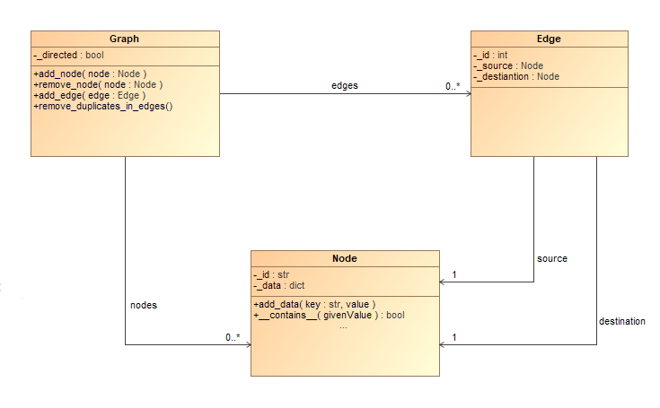

# Graph Explorer

## Team 19

### Team members

- Ružica Došenović R2 37/2023
- Branislav Roljić R2 6/2023
- Nikola Jović R2 1/2023

## Overview

The project centers on visualizing graph structures, integrating various data sources for smooth representation. Adopting Component-Driven Development principles, this software enables users to easily alter individual components using plugins.

## Application Architecture

### Visualizer Plugins

  - **Simple Visualizer**: Renders graphs with nodes containing minimal details, making it suitable for providing a quick overview of larger graphs without excessive information.

  - **Block Visualizer**: Renders graphs as blocks, showcasing all associated details. This plugin works best for smaller graphs but is not advisable for very large graphs due to possible complexity and dense information.
  
### Data Source Plugins

  - **JSON Data Source**: Reads data from a JSON file and constructs a graph from it. It identifies and creates nodes and edges based on the structure of the JSON data. 

  - **XML Data Source**: Processes XML data and constructs a graph from it, creating nodes and edges based on the hierarchical structure of the XML elements. By handling element attributes and text content, the parser effectively converts XML data into a navigable and interconnected graph representation.
  
### API and Platform

  - **API module**: Incorporates core functionality with structured models like Graph, Node and Edge, alongside abstract services and utility classes. These models define graph structures, their elements, and interconnections.

  - **Platform module**: Oversees workspace creation and management, as well as the handling of active graph instances. It includes tools for graph search, filtering, and efficient management of extensive datasets for visualization and user interaction.

### Class Model

  - **Graph**: Defines the organization of a graph and offers functionalities for modification.
  
  - **Node**: Represents an individual graph node, containing node-specific attributes and information.
  
  - **Edge**: Signifies a connection between two nodes within the graph, containing edge-specific attributes and information.



### Software Components

The software is segmented into two primary perspectives:

  - **Main View**: Serves as a display area that utilizes visualizer plugins to visualize the graph in two different modes. It offers functionalities including panning, zooming, dragging, and dropping:
    - Nodes can be dragged to different positions on the display.
    - Users can pan across the canvas and zoom in or out using mouse controls.

  - **Bird View**: Provides a high-level overview of the graph from a top-down perspective, ensuring the entire graph is fully visible within the canvas. It mirrors the Main View but with the distinction that the entire graph is scaled to fit within the canvas. The Bird View viewport adjusts dynamically to match the current display area in the Main View.
    - When zooming out in the Main View, the Bird View reduces the viewport size.
    - When zooming in on the Main View, the Bird View enlarges the viewport.
    - Panning in the Main View shifts the viewport in the Bird View.
    - Dragging nodes in the Main View updates the graph in the Bird View.

## Installation

To install and run the project, follow these steps:

1. Clone the repository:
   ```bash
   git clone https://github.com/branislavroljic/soik-graph-expressiveness
   ```

2. Navigate to the project directory:
   ```bash
   cd .\soik-graph-expressiveness\
   ```
   
3. Create a virtual environment:
   ```bash
   python -m venv .venv
   ```
   
4. Activate a virtual environment:
   ```bash
   .venv\Scripts\activate
   ```

5. Run script that will install the required packages, application packages and plugins, and run application:
   ```bash
   .\script.ps1  
   ```

6. Open your web browser and navigate to the following URL:
   ```
   http://127.0.0.1:8000/
   ```
   